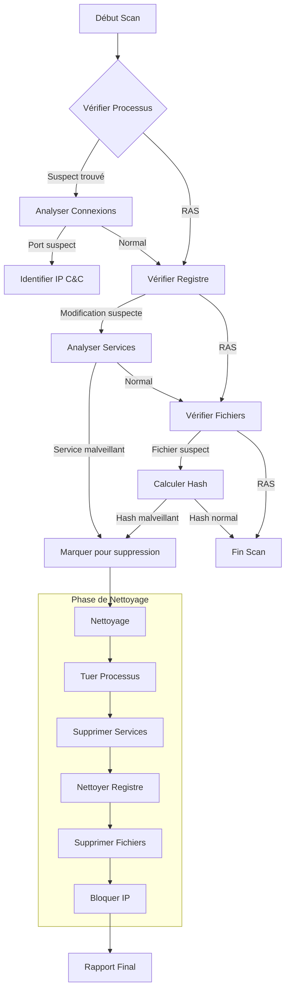

```mermaid
flowchart TB
    A[Début Scan] --> B{Vérifier Processus}
    B -->|Suspect trouvé| C[Analyser Connexions]
    B -->|RAS| D[Vérifier Registre]
    
    C -->|Port suspect| E[Identifier IP C&C]
    C -->|Normal| D
    
    D -->|Modification suspecte| F[Analyser Services]
    D -->|RAS| G[Vérifier Fichiers]
    
    F -->|Service malveillant| H[Marquer pour suppression]
    F -->|Normal| G
    
    G -->|Fichier suspect| I[Calculer Hash]
    G -->|RAS| J[Fin Scan]
    
    I -->|Hash malveillant| H
    I -->|Hash normal| J
    
    H --> K[Nettoyage]
    
    subgraph "Phase de Nettoyage"
    K --> L[Tuer Processus]
    L --> M[Supprimer Services]
    M --> N[Nettoyer Registre]
    N --> O[Supprimer Fichiers]
    O --> P[Bloquer IP]
    end
    
    P --> Q[Rapport Final]
```