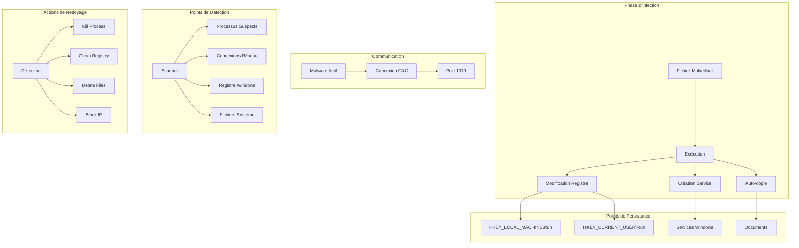

```mermaid
graph TD
    subgraph "Phase d'Infection"
        A[Fichier Malveillant] --> B[Exécution]
        B --> C[Auto-copie]
        B --> D[Modification Registre]
        B --> E[Création Service]
    end

    subgraph "Points de Persistance"
        D --> F[HKEY_LOCAL_MACHINE\Run]
        D --> G[HKEY_CURRENT_USER\Run]
        E --> H[Services Windows]
        C --> I[Documents]
    end

    subgraph "Communication"
        J[Malware Actif] --> K[Connexion C&C]
        K --> L[Port 1010]
    end

    subgraph "Points de Détection"
        M[Scanner] --> N[Processus Suspects]
        M --> O[Connexions Réseau]
        M --> P[Registre Windows]
        M --> Q[Fichiers Système]
    end

    subgraph "Actions de Nettoyage"
        R[Détection] --> S[Kill Process]
        R --> T[Clean Registry]
        R --> U[Delete Files]
        R --> V[Block IP]
    end
```