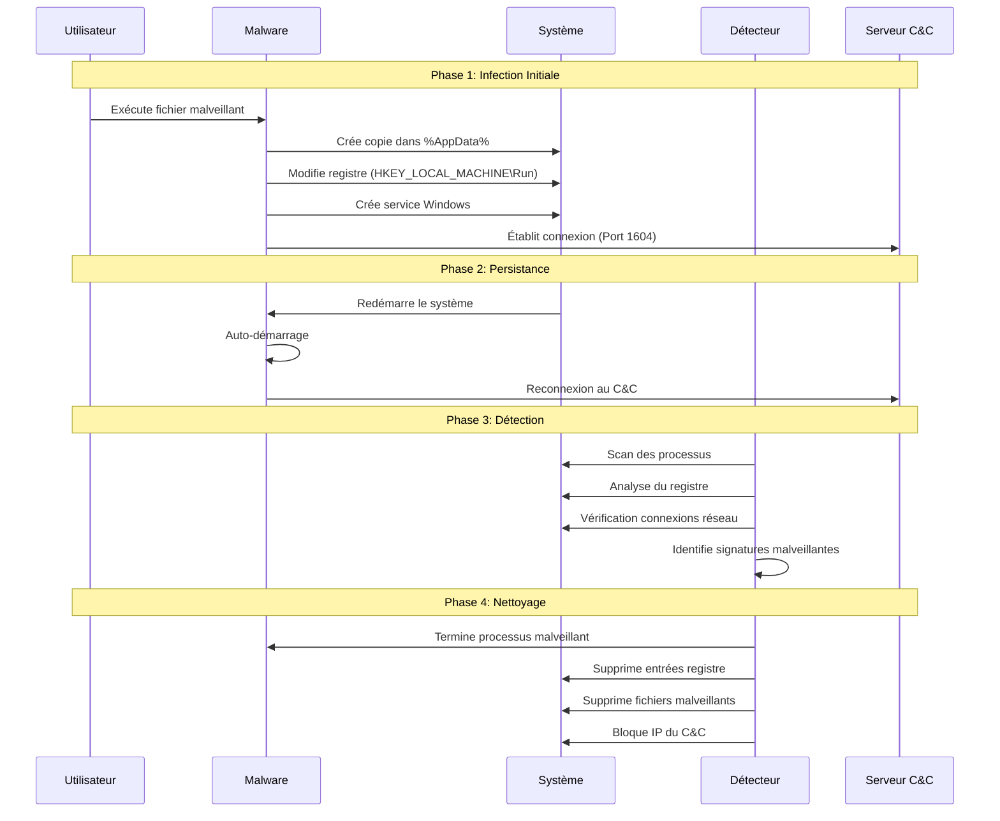

```mermaid
sequenceDiagram
    participant U as Utilisateur
    participant M as Malware
    participant S as Système
    participant D as Détecteur
    participant C as Serveur C&C

    Note over U,C: Phase 1: Infection Initiale
    U->>M: Exécute fichier malveillant
    M->>S: Crée copie dans %AppData%
    M->>S: Modifie registre (HKEY_LOCAL_MACHINE\Run)
    M->>S: Crée service Windows
    M->>C: Établit connexion (Port 1604)

    Note over U,C: Phase 2: Persistance
    S->>M: Redémarre le système
    M->>M: Auto-démarrage
    M->>C: Reconnexion au C&C

    Note over U,C: Phase 3: Détection
    D->>S: Scan des processus
    D->>S: Analyse du registre
    D->>S: Vérification connexions réseau
    D->>D: Identifie signatures malveillantes

    Note over U,C: Phase 4: Nettoyage
    D->>M: Termine processus malveillant
    D->>S: Supprime entrées registre
    D->>S: Supprime fichiers malveillants
    D->>S: Bloque IP du C&C
```